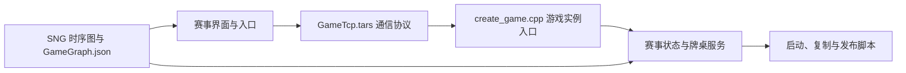
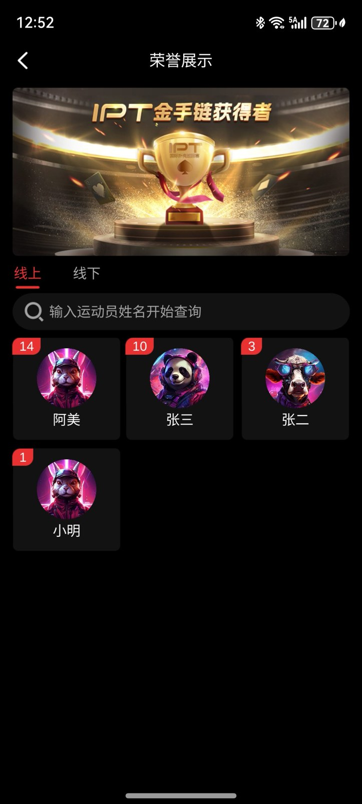
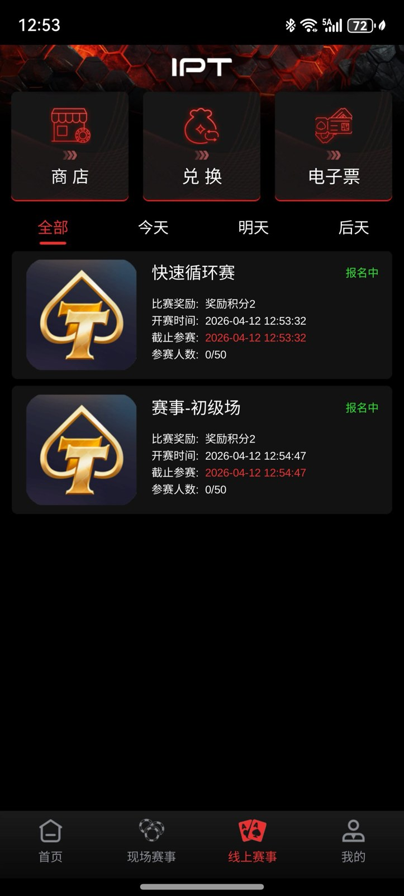

# 德州锦标赛源码｜赛事大厅、Tars 协议与玩法流程

> 中文简体 · 中文繁體 · English 多语言产品与源码资料

[简体中文](README.zh-CN.md) · [繁體中文](README.zh-TW.md) · [English](README.en.md) · [产品页面](https://niubideren111.github.io/Texas-Hold-em-Tournament-Source-Code/zh-cn/)

以扑克赛事大厅和锦标赛产品为主题，提供比赛展示截图、游戏入口代码、Tars 协议及玩法流程资料。适合了解赛事类客户端界面与服务端模块的衔接。

**德州锦标赛源码 · 德州赛事源码 · MTT源码 · SNG源码**

## 项目重点

### 赛事界面展示

赛事列表、品牌赛事和俱乐部相关界面共同展示竞技产品的页面结构。

### 协议与游戏入口

GameTcp.tars 提供协议入口，create_game.cpp 提供游戏实例创建代码。

### 玩法时序与资源配置

SNG 流程图、资源图配置及开发规范为团队阅读项目提供入口。

## 赛事玩法与产品流程

| 阶段 | SNG（坐满即开） | MTT（定时多桌） |
|---|---|---|
| 报名 | 达到设定人数后进入开赛条件 | 在报名时间内加入赛事 |
| 开赛 | 单桌座位与初始筹码 | 多桌分配、统一盲注级别 |
| 进行 | 盲注推进、淘汰至最终名次 | 盲注推进、淘汰、合桌与桌间平衡 |
| 结束 | 输出单桌排名与奖励结果 | 输出决赛桌排名与赛事结果 |

> 上表说明锦标赛产品的一般流程；本仓库公开证据包括赛事界面、SNG 时序图、C++ 入口、Tars 协议和脚本。完整报名、桌间平衡、奖励结算仍需在完整工程中验收。

## 技术组成



| 层次 | 仓库证据 | 用途 |
|---|---|---|
| 接口协议 | `GameTcp.tars` | 定位客户端与游戏服务间的通信定义 |
| 游戏入口 | `create_game.cpp` | 定位游戏实例创建逻辑 |
| 回调逻辑 | `AsyncLoginCallback.cpp`、`AsyncGetUserCallback.cpp` | 理解异步登录与用户数据回调 |
| 资源与流程 | `GameGraph.json`、SNG 时序图 | 对照资源配置和赛事交互流程 |
| 运维脚本 | `script/`、`copy.sh`、`publish.sh`、`makefile` | 核对构建、复制、启动与发布入口 |

## 资料阅读与核对方式

1. **先确认产品形态**：依次查看截图和图注，确认产品类型与可见功能流程。
2. **再核对文件证据**：直接打开下方列出的源码或文档，不只依赖功能描述。
3. **检查可构建范围**：确认准备运行的部分是否具备依赖、资源、配置和启动脚本。
4. **确认授权**：阅读仓库许可；商业素材及完整工程交付应另行取得书面授权。

## 产品截图

| 赛事列表 | 品牌赛事 |
|---|---|
|  |  |
| **赛事入口** | **产品首页** |
|  |  |

## 公开源码与资料

| 文件 | 说明 |
|---|---|
| [GameTcp.tars](GameTcp.tars) | 游戏通信协议定义 |
| [create_game.cpp](create_game.cpp) | 游戏实例创建入口 |
| [GameGraph.json](GameGraph.json) | 资源图配置 |
| [Doc/游戏玩法/GamePlay(SNG)-时序图.png](Doc/%E6%B8%B8%E6%88%8F%E7%8E%A9%E6%B3%95/GamePlay(SNG)-%E6%97%B6%E5%BA%8F%E5%9B%BE.png) | SNG 玩法时序图 |
| [script/start.sh](script/start.sh) | 服务启动脚本资料 |

## 开始阅读

```bash
git clone https://github.com/niubideren111/Texas-Hold-em-Tournament-Source-Code.git
cd Texas-Hold-em-Tournament-Source-Code
```

## 常见问题

### SNG 与 MTT 关注点有什么不同？

SNG 重点是单桌人数与开赛条件，MTT 还涉及多桌调度、淘汰和合桌；本仓库提供赛事产品与流程资料。

### 哪个文件用于理解服务端入口？

先阅读 create_game.cpp 与 GameTcp.tars，再对照玩法时序图和服务脚本。

## 后续资料完善方向

分别上传 SNG 和 MTT 的状态说明、盲注表样例、排名协议与结算测试记录，避免只用截图替代接口文档。 后续更新还应加入版本化依赖清单、经过验证的构建或导入步骤、简明架构/产品流程图，以及能对应真实文件变化的版本记录。大型授权资源可放入 GitHub Releases 并提供校验值，不能提交密钥、生产地址或用户数据。

## 相关项目

- [dezhou-poker-club-source-code](https://github.com/niubideren111/dezhou-poker-club-source-code)
- [Texas-Holdem-Game-Source-Code](https://github.com/niubideren111/Texas-Holdem-Game-Source-Code)

## 资料范围与许可

公开仓库包含 C++ 片段、协议和配置资料、流程图与比赛截图；完整报名、开赛、淘汰及结算链路需在完整工程中验收。 公开内容以实际文件、依赖和许可为准，不承诺搜索排名、直接上线或固定性能结果。

- Telegram: [@fox_lovemyself](https://t.me/fox_lovemyself)
- GitHub: [Texas-Hold-em-Tournament-Source-Code](https://github.com/niubideren111/Texas-Hold-em-Tournament-Source-Code)
