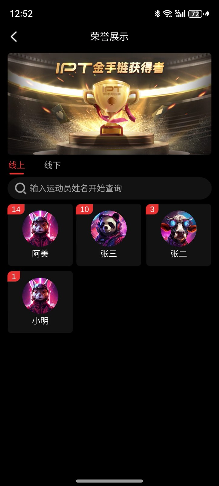
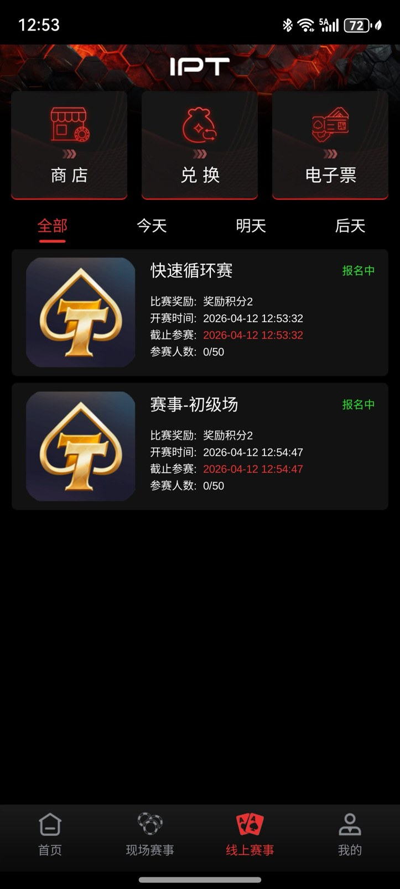

# 德州錦標賽原始碼｜賽事大廳、Tars 協議與玩法流程

[简体中文](README.zh-CN.md) · [繁體中文](README.zh-TW.md) · [English](README.en.md) · [产品页面](https://niubideren111.github.io/Texas-Hold-em-Tournament-Source-Code/zh-tw/)

以扑克賽事大廳和錦標賽產品為主題，提供比賽展示截圖、遊戲進入點程式碼、Tars 協議及玩法流程資料。適合了解賽事類用戶端介面與伺服器端模組的衔接。

**德州錦標賽原始碼 · 德州賽事原始碼 · MTT原始碼 · SNG原始碼**

## 專案重點

### 賽事介面展示

賽事列表、品牌賽事和俱樂部相關介面共同展示竞技產品的頁面結构。

### 協議與遊戲進入點

GameTcp.tars 提供協議進入點，create_game.cpp 提供遊戲實例建立程式碼。

### 玩法時序與資源設定

SNG 流程圖、資源圖設定及開發規范為團隊閱讀專案提供進入點。

## 資料閱讀與核對方式

1. **先確認產品形態**：依序檢視截圖與圖說，確認產品類型和可見功能流程。
2. **再核對檔案證據**：直接開啟下方列出的原始碼或文件，不只依賴功能描述。
3. **檢查可建置範圍**：確認欲執行的部分是否具備相依套件、資源、設定與啟動腳本。
4. **確認授權**：閱讀儲存庫授權；商業素材及完整工程交付應另行取得書面授權。

## 產品截圖







## 公開原始碼與資料

| 文件 | 说明 |
|---|---|
| [GameTcp.tars](GameTcp.tars) | 遊戲通信協議定義 |
| [create_game.cpp](create_game.cpp) | 遊戲實例建立進入點 |
| [GameGraph.json](GameGraph.json) | 資源圖設定 |
| [Doc/游戏玩法/GamePlay(SNG)-时序图.png](Doc/%E6%B8%B8%E6%88%8F%E7%8E%A9%E6%B3%95/GamePlay(SNG)-%E6%97%B6%E5%BA%8F%E5%9B%BE.png) | SNG 玩法時序圖 |
| [script/start.sh](script/start.sh) | 服務啟動腳本資料 |

## 開始閱讀

```bash
git clone https://github.com/niubideren111/Texas-Hold-em-Tournament-Source-Code.git
cd Texas-Hold-em-Tournament-Source-Code
```

## 常見問題

### SNG 與 MTT 關注點有什麼不同？

SNG 重點是單桌人數與開賽条件，MTT 还涉及多桌調度、淘汰和合桌；本儲存庫提供賽事產品與流程資料。

### 哪個文件用於理解伺服器端進入點？

先閱讀 create_game.cpp 與 GameTcp.tars，再對照玩法時序圖和服務腳本。

## 後續資料完善方向

分別上傳 SNG 和 MTT 的狀態說明、盲注表样例、排名協議與結算測試記錄，避免只用截圖替代介面文件。 後續更新還應加入版本化相依清單、經過驗證的建置或匯入步驟、簡明架構／產品流程圖，以及能對應真實檔案變更的版本記錄。大型授權資源可放入 GitHub Releases 並提供校驗值，不能提交密鑰、生產位址或使用者資料。

## 相關專案

- [dezhou-poker-club-source-code](https://github.com/niubideren111/dezhou-poker-club-source-code)
- [Texas-Holdem-Game-Source-Code](https://github.com/niubideren111/Texas-Holdem-Game-Source-Code)

## 資料範圍與授權

公開儲存庫包含 C++ 片段、協議和設定資料、流程圖與比賽截圖；完整报名、開賽、淘汰及結算鏈路需在完整工程中驗收。 公開內容以實際檔案、相依套件與授權為準，不承諾搜尋排名、直接上線或固定效能結果。

- Telegram: [@fox_lovemyself](https://t.me/fox_lovemyself)
- GitHub: [Texas-Hold-em-Tournament-Source-Code](https://github.com/niubideren111/Texas-Hold-em-Tournament-Source-Code)
